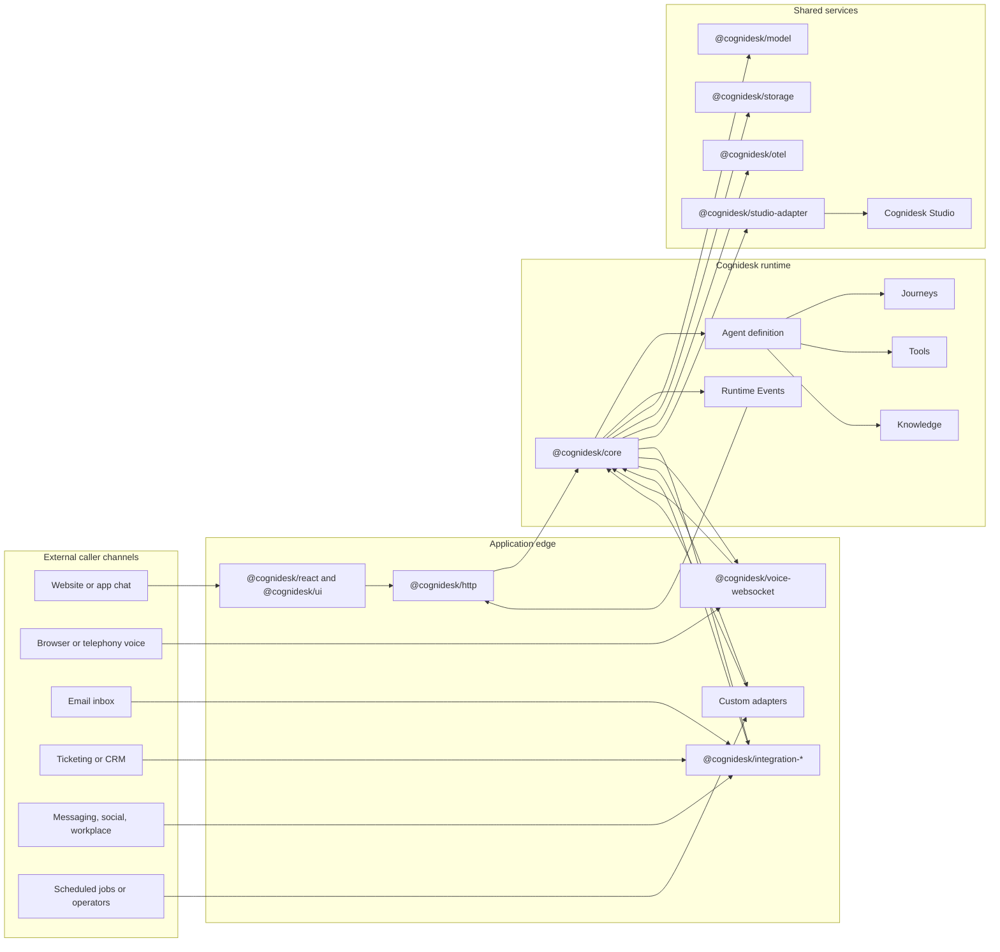
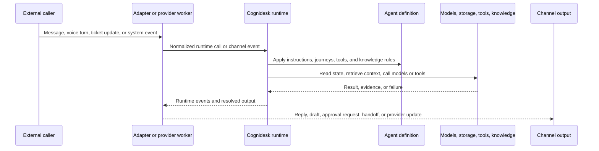

# Architecture Overview

This page is the non-specialist map of Cognidesk. It explains who can call into a Cognidesk application, which components exist, and how work moves through the system.

## One picture

In plain language: external channels bring support work in, adapters translate it into the Cognidesk runtime, and the runtime decides what should happen next. The runtime can answer, ask for more information, run a tool, retrieve knowledge, draft an action, wait for approval, hand off, or emit events for a UI and operations.

Editable diagram source: [Cognidesk architecture Excalidraw](../assets/diagrams/cognidesk-architecture.excalidraw).

## Component roles

| Component | Plain-language role | Typical package |
|-----------|---------------------|-----------------|
| External caller channels | Places where customers, operators, or systems start support work. | Website chat, voice, email, ticketing, CRM, WhatsApp, Slack, scheduled jobs |
| Application edge | The application-owned boundary that receives traffic, verifies it, and calls Cognidesk. | `@cognidesk/http`, `@cognidesk/voice-websocket`, provider packages, custom code |
| Runtime core | The conversation engine. It owns conversation state, agent turns, journeys, tools, knowledge, and runtime events. | `@cognidesk/core` |
| Agent definition | The configured support agent: instructions, journeys, tools, knowledge, custom events, and channel behavior. | `@cognidesk/core` |
| Journeys | Structured support paths such as booking changes, handoff, identity checks, or ticket updates. | `@cognidesk/core` |
| Tools | Typed actions the agent can ask to run, such as looking up a ticket or creating a support note. | `@cognidesk/core`, provider integrations, application code |
| Knowledge sources | Approved reference material the agent can retrieve before answering. | `@cognidesk/core`, application code |
| Model adapters | Connections to the selected model providers for generation, matching, extraction, and other model roles. | `@cognidesk/model` |
| Storage adapters | Persistence for conversations, runtime events, snapshots, and runtime state. | `@cognidesk/storage` |
| Runtime events | The timeline of what happened. UIs, streaming, Studio, telemetry, and tests can inspect these events. | `@cognidesk/core`, `@cognidesk/http` |
| React UI | Optional browser UI for chat and custom widgets. | `@cognidesk/react`, `@cognidesk/ui` |
| Provider integrations | Optional packages for external systems such as email, messaging, ticketing, social, workplace, contact center, ecommerce, video, and voice providers. | `@cognidesk/integration-{category}-{provider}` |
| Observability | Spans, metrics, and dashboards for runtime, model, tool, storage, and adapter behavior. | `@cognidesk/otel` |
| Studio | Local operations app for inspecting a configured target, conversations, telemetry, and operator workflows. | `@cognidesk/studio`, `@cognidesk/studio-adapter`, `@cognidesk/studio-contracts` |

## External caller channels

| Channel family | Who usually calls | Entry path | Output path |
|----------------|-------------------|------------|-------------|
| Website or app chat | Customer in a browser or mobile webview | React widget or custom UI calls the HTTP adapter | Runtime events stream back over HTTP/SSE and the UI renders replies or widgets |
| Voice | Customer speaking through a browser or telephony bridge | Voice handshake plus the Voice WebSocket adapter and a voice provider | Transcripts enter the runtime; spoken or text responses return through the voice adapter |
| Email | Mailbox provider or polling worker | Provider integration or custom worker normalizes inbound mail | Reply, draft, internal note, approval, or handoff through configured provider operations |
| Messaging and social | WhatsApp, Messenger, Instagram, Discord, RCS, or similar provider | Provider webhook, event API, or application worker | Send, draft, thread update, handoff, or provider-specific operation when configured |
| Ticketing, CRM, and contact center | Zendesk, ServiceNow, Salesforce, Genesys, Amazon Connect, or similar system | Provider webhook, sync worker, or operator action | Ticket update, note, callback, handoff, provider object operation, or internal support response |
| Workplace channels | Slack, Teams, or internal collaboration tools | Provider event or app command | Internal answer, note, workflow step, approval request, or handoff |
| Scheduled and system events | Cron job, product backend, workflow engine, or Studio operator | Custom adapter or runtime event route | Reminder, follow-up, status check, escalation, or another configured action |

A channel is not enabled just because a package exists. The application chooses which channels to expose, which credentials to use, which provider operations are available, and which actions require confirmation or approval.

## How a turn moves through the system

The important part is the split of responsibilities. Adapters know how to speak to the outside world. The runtime knows how to run a support conversation. Provider integrations know selected provider surfaces, but they do not decide business policy on their own.

## Boundaries to remember

- `@cognidesk/core` is transport-neutral. It does not depend on HTTP, WebSockets, React, or a specific server framework.
- Provider packages are optional and explicit. Installing or registering a provider does not automatically expose every provider API or permit live behavior.
- The SDK user owns credentials, consent, retention, channel policy, risk policy, and approval rules.
- Runtime events are the shared operational record for streaming UIs, Studio, telemetry, replay, and tests.
- Studio observes and operates against a configured target. It is not a customer channel and it should not create a hidden configuration model separate from the SDK.

## Where to go next

- [Transport Neutrality](transport-neutrality.md) explains why the runtime is separate from HTTP and WebSocket transports.
- [Runtime Events](runtime-events.md) explains the event timeline that UIs and operations consume.
- [HTTP Transport](../guides/http-transport.md) shows the REST and SSE endpoints.
- [Voice](../guides/voice.md) shows how live voice connects through the runtime.
- [Provider Integrations](../guides/provider-packages.md) explains external provider packages and capability boundaries.
- [React UI](../guides/react-ui.md) shows the optional chat UI and hooks.
- [Observability](../guides/observability.md) shows tracing, metrics, and dashboards.
