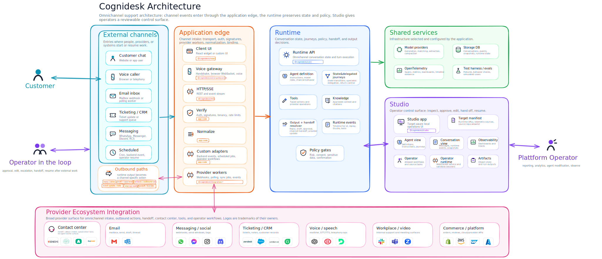
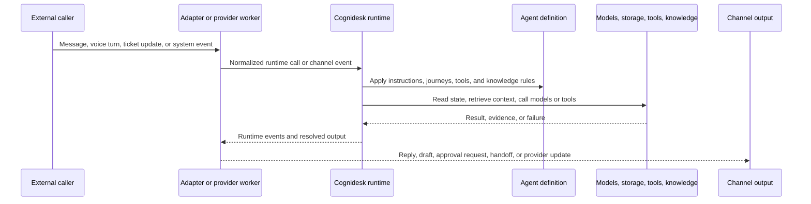

# Architecture Overview

Customers, providers, schedules, and operators enter through configured channels, but those channels do not create separate agent architectures. The application edge verifies the source, normalizes the event, binds it to a conversation, and calls the same runtime surface.

The runtime is the center of gravity. It preserves conversation state, applies the agent definition, activates state or delegated journeys, scopes tools and knowledge, and resolves outputs through policy gates. That means a reply, draft, callback, ticket update, channel handoff, human approval, or provider operation all pass through one support-level decision model instead of being hidden inside a channel adapter.

Studio sits beside the runtime rather than above it. It inspects an explicit target, shows conversations and telemetry, and lets operators run allowed workflows through a reviewable operator surface. Provider integrations stay outside the runtime core: they add concrete capabilities for email, messaging, ticketing, contact center, voice, workplace, commerce, and other systems only when the application installs, configures, and enables them.

For the operational view of that Studio block, see [Cognidesk Studio](../studio/index.md).

## Architecture highlights

| Capability | What the architecture preserves |
|------------|---------------------------------|
| Omnichannel continuity | Chat, voice, email, messaging, ticketing, contact-center, workplace, scheduled, and operator events enter through the same support-level runtime model instead of becoming separate products. |
| State and delegated journeys | State-machine journeys keep workflow progress explicit, while delegated journeys can hand specialist work to a focused execution unit and return control to the main agent. |
| Channel handoff | A customer can move between configured channels or channel segments while preserving the same Cognidesk conversation when the application policy permits it. |
| Human-in-the-loop | Approval, editing, escalation, handoff, and resume are runtime-visible outcomes, not hidden callbacks inside a model or provider adapter. |
| Studio operator loop | Studio inspects a configured target and gives operators a reviewable control surface for conversations, agents, telemetry, artifacts, and allowed source-workflows. |
| Provider breadth without provider lock-in | Provider integrations cover email, messaging, social, ticketing, CRM, contact center, voice, workplace, video, commerce, and cloud/provider APIs, but each package exposes only configured capabilities. |
| Outbound resolution | Replies, drafts, callbacks, outbound calls, ticket notes, internal notifications, and handoff requests all pass through policy and capability checks before delivery. |
| Audit and replay | Runtime events, storage, OpenTelemetry, and Studio views share the same event record so conversations can be inspected, replayed, tested, and evaluated. |

## Component roles

| Component | Plain-language role | Typical package |
|-----------|---------------------|-----------------|
| External caller channels | Places where customers, operators, or systems start support work. | Website chat, voice, email, ticketing, CRM, WhatsApp, Slack, scheduled jobs |
| Application edge | The application-owned boundary that receives traffic, verifies it, and calls Cognidesk. | `@cognidesk/http`, `@cognidesk/voice-websocket`, provider packages, custom code |
| Runtime core | The conversation engine. It owns conversation state, agent turns, journeys, tools, knowledge, and runtime events. | `@cognidesk/core` |
| Agent definition | The configured support agent: instructions, journeys, tools, knowledge, custom events, and channel behavior. | `@cognidesk/core` |
| State and delegated journeys | Structured support paths such as booking changes, handoff, identity checks, specialist delegation, or ticket updates. | `@cognidesk/core` |
| Tools | Typed actions the agent can ask to run, such as looking up a ticket or creating a support note. | `@cognidesk/core`, provider integrations, application code |
| Knowledge sources | Approved reference material the agent can retrieve before answering. | `@cognidesk/core`, application code |
| Output resolver and policy gates | Shared decision path for replies, drafts, approvals, channel handoff, outbound contact, provider updates, and denial. | `@cognidesk/core`, application policy |
| Model adapters | Connections to the selected model providers for generation, matching, extraction, and other model roles. | `@cognidesk/model` |
| Storage adapters | Persistence for conversations, runtime events, snapshots, and runtime state. | `@cognidesk/storage` |
| Runtime events | The timeline of what happened. UIs, streaming, Studio, telemetry, and tests can inspect these events. | `@cognidesk/core`, `@cognidesk/http` |
| React UI | Optional browser UI for chat and custom widgets. | `@cognidesk/react`, `@cognidesk/ui` |
| Provider integrations | Optional packages for external systems such as email, messaging, ticketing, social, workplace, contact center, ecommerce, video, and voice providers. | `@cognidesk/integration-{category}-{provider}` |
| Observability | Spans, metrics, and dashboards for runtime, model, tool, storage, and adapter behavior. | `@cognidesk/otel` |
| Studio and operator runtime | Local operations app and operator execution service for inspecting a configured target, conversations, telemetry, artifacts, and allowed workflows. | `@cognidesk/studio`, `@cognidesk/studio-adapter`, `@cognidesk/studio-contracts`, `@cognidesk/studio-operator-runtime` |

## External caller channels

| Channel family | Who usually calls | Entry path | Output path |
|----------------|-------------------|------------|-------------|
| Website or app chat | Customer in a browser or mobile webview | React widget or custom UI calls the HTTP adapter | Runtime events stream back over HTTP/SSE and the UI renders replies or widgets |
| Voice | Customer speaking through a browser or telephony bridge | Voice handshake plus the Voice WebSocket adapter and a voice provider | Transcripts enter the runtime; spoken or text responses return through the voice adapter |
| Email | Mailbox provider or polling worker | Provider integration or custom worker normalizes inbound mail | Reply, draft, internal note, approval, or handoff through configured provider operations |
| Messaging and social | WhatsApp, Messenger, Instagram, Discord, RCS, or similar provider | Provider webhook, event API, or application worker | Send, draft, thread update, handoff, or provider-specific operation when configured |
| Ticketing, CRM, and contact center | Zendesk, ServiceNow, Salesforce, Genesys, Amazon Connect, or similar system | Provider webhook, sync worker, or operator action | Ticket update, note, callback, handoff, provider object operation, or internal support response |
| Workplace channels | Slack, Teams, or internal collaboration tools | Provider event or app command | Internal answer, note, workflow step, approval request, or handoff |
| Scheduled and system events | Cron job, product backend, workflow engine, or Studio operator | Custom adapter or runtime event route | Reminder, follow-up, status check, escalation, or another configured action |

A channel is not enabled just because a package exists. The application chooses which channels to expose, which credentials to use, which provider operations are available, and which actions require confirmation or approval.

## How a turn moves through the system

The important part is the split of responsibilities. Adapters know how to speak to the outside world. The runtime knows how to run a support conversation. Provider integrations know selected provider surfaces, but they do not decide business policy on their own.

## Boundaries to remember

- `@cognidesk/core` is transport-neutral. It does not depend on HTTP, WebSockets, React, or a specific server framework.
- Provider packages are optional and explicit. Installing or registering a provider does not automatically expose every provider API or permit live behavior.
- The SDK user owns credentials, consent, retention, channel policy, risk policy, and approval rules.
- Runtime events are the shared operational record for streaming UIs, Studio, telemetry, replay, and tests.
- Studio observes and operates against a configured target. It is not a customer channel and it should not create a hidden configuration model separate from the SDK.

## Where to go next

- [Transport Neutrality](transport-neutrality.md) explains why the runtime is separate from HTTP and WebSocket transports.
- [Runtime Events](runtime-events.md) explains the event timeline that UIs and operations consume.
- [HTTP Transport](../guides/http-transport.md) shows the REST and SSE endpoints.
- [Voice](../guides/voice.md) shows how live voice connects through the runtime.
- [Provider Integrations](../guides/provider-packages.md) explains external provider packages and capability boundaries.
- [React UI](../guides/react-ui.md) shows the optional chat UI and hooks.
- [Observability](../guides/observability.md) shows tracing, metrics, and dashboards.
- [Cognidesk Studio](../studio/index.md) shows the operations surface for target inspection, conversations, dashboards, and operator workflows.
