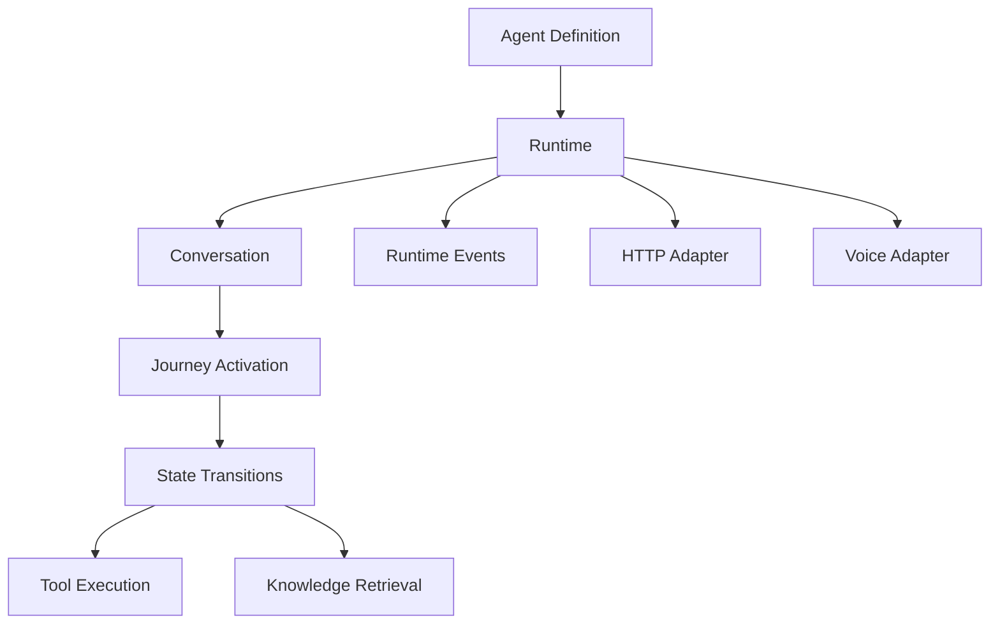

# Concepts

Cognidesk has a precise domain language. Understanding these concepts will make the guides and API reference much clearer.

## Core building blocks

| Concept | What it is |
|---------|-----------|
| [Architecture Overview](architecture.md) | A non-specialist map of channels, adapters, runtime components, and operations |
| [Agent](agents.md) | A compiled definition that owns instructions, tools, knowledge, and journeys |
| [Journey](journeys.md) | A state machine that guides a conversation through structured steps |
| [Tool](tools.md) | A typed function the agent can invoke during a conversation |
| [Knowledge Source](knowledge-sources.md) | A retrieval-augmented source the agent can query for context |
| [Runtime Event](runtime-events.md) | A typed event emitted during conversation execution |
| [Transport Neutrality](transport-neutrality.md) | The principle that core has zero transport dependencies |

## How they fit together

The **Runtime** is the execution engine. It takes a compiled **Agent** definition and manages **Conversations**. During a conversation, the runtime may activate a **Journey** (a state machine), execute **Tools**, retrieve **Knowledge**, and emit **Runtime Events**.

**Adapters** (HTTP, Voice, Storage) connect the transport-neutral runtime to the outside world.
