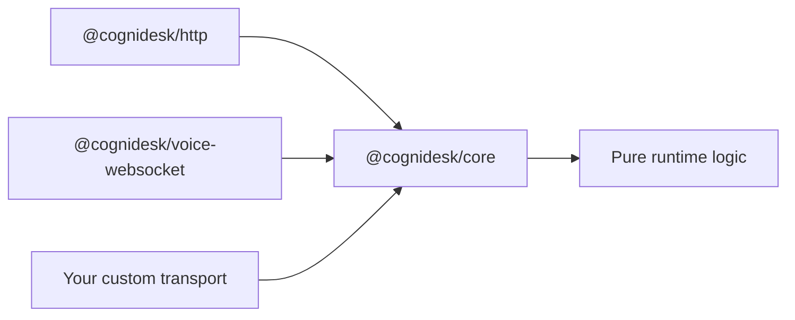

# Transport Neutrality

**Transport Neutrality** is the architectural principle that the Cognidesk runtime has zero dependencies on HTTP, WebSockets, or any specific transport protocol.

## Why it matters

Many AI frameworks bind the runtime directly to an HTTP server. This creates problems:

- Can't run in serverless functions without adaptation
- Can't embed in CLI tools or desktop apps
- Can't test without standing up a server
- Can't swap transports (HTTP → WebSocket → gRPC)

Cognidesk's core package (`@cognidesk/core`) imports no HTTP libraries, no server frameworks, and no streaming protocols.

## How it works



The runtime exposes a programmatic API. Transport adapters (HTTP, Voice, custom) wrap that API for specific protocols:

```typescript
// Core — no transport awareness
const runtime = createRuntime({ storage, agent, models });
const response = await runtime.sendMessage({ conversationId, message });

// HTTP adapter — wraps core for REST + SSE
const handler = createCognideskHttpHandler({ runtime, agentId, basePath: "/api" });

// Voice adapter — wraps core for realtime audio
const voiceHandler = createVoiceHandler({ runtime, agentId });
```

## What this enables

| Deployment | Transport | Works with core? |
|-----------|-----------|:---:|
| Express/Fastify server | HTTP + SSE | :material-check: |
| Cloudflare Workers | HTTP | :material-check: |
| CLI tool | Direct function calls | :material-check: |
| Desktop app (Electron) | IPC | :material-check: |
| Test suite | In-memory | :material-check: |
| Voice call | WebSocket | :material-check: |

## Built-in adapters

Cognidesk ships adapters for common transports as separate packages:

- `@cognidesk/http` — REST POST + SSE streaming
- `@cognidesk/voice-websocket` — Voice browser protocol
- `@cognidesk/voice-openai` — OpenAI Realtime connection

These are optional conveniences — you can always build your own adapter against the core API.
