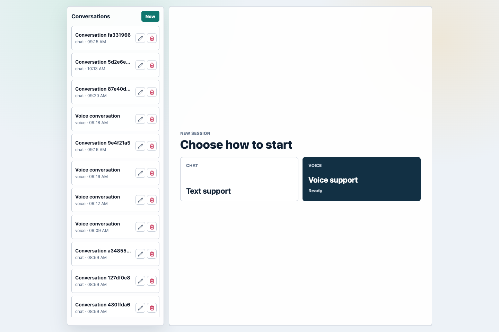
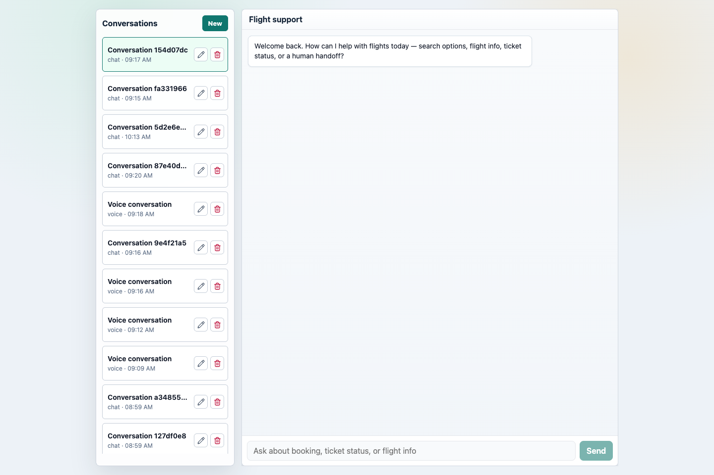
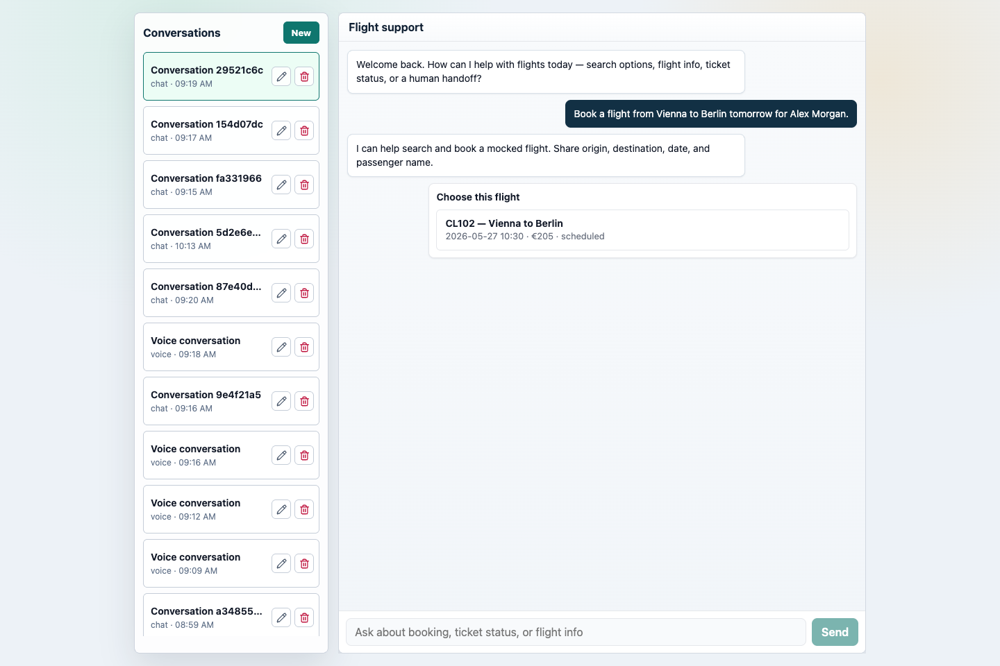
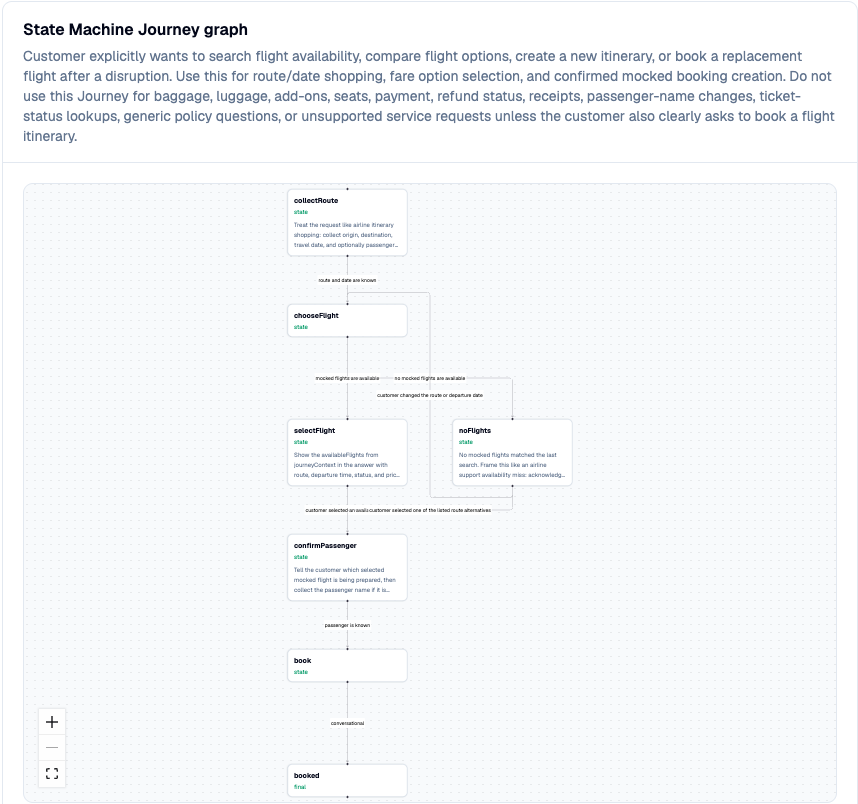

# Flight Demo

A complete customer support agent for a fictional airline. This example demonstrates all major Cognidesk features working together.

The demo is intentionally small enough to run locally, but it uses the same runtime pieces as a real target: a compiled agent, state-machine journeys, a delegated journey, tools, knowledge, widgets, chat, voice, optional external channels, Studio Adapter endpoints, storage, and telemetry hooks.



## What it shows

| Feature | Implementation |
|---------|---------------|
| Agent with instructions | Concise flight support persona |
| Tools | Ticket lookup, flight search, booking |
| Knowledge sources | FAQ retrieval |
| State machine journeys | Ticket status flow with identification |
| Studio target adapter | Introspection, configuration surfaces, conversations, dashboards |
| Mocked flight-service APIs | Ticket lookup, flight search, booking |
| HTTP transport | REST + SSE |
| React chat widget | Full UI with custom widgets |
| Voice | Real-time voice conversations |
| External integration opt-in | Secure Email, Discord handoff, and WhatsApp Journeys can be enabled independently |
| OpenTelemetry | Pre-built Grafana dashboards |

## Customer experience

The customer-facing app starts with a simple choice: chat or voice. Both modes create Cognidesk conversations against the same `flight-service` agent, and the conversation sidebar makes it easy to resume local sessions.



The booking flow shows why the demo is useful as a reference app. A normal support request activates the `book-flight` state-machine journey, extracts route and date, calls mocked flight-service tools, and emits a choice widget for the available itinerary.



Studio shows the same booking behavior as a state-machine flow, so the demo is not just a chat transcript. Builders can see the states, branches, tool-backed steps, and final booking path that drive the customer experience.



The same pattern appears in other flows:

| Request | What the demo exercises |
|---------|-------------------------|
| `Book a flight from Vienna to Berlin tomorrow for Alex Morgan.` | `book-flight` state machine, route/date extraction, mocked search tool, choice widget, and booking confirmation. |
| `What is the status of booking CD-CL204-4821?` | `ticket-status` journey and mocked booking/status lookup. |
| `Can I check in for CL204?` | Ticket-status path with flight-number extraction. |
| `What baggage is included in economy?` | Knowledge retrieval and policy-grounded answer. |
| `Please add a checked bag to CD-CL204-4821.` | `baggage-service` delegated journey. |
| `My flight was cancelled and I need a person.` | Human handoff path when Discord handoff is enabled; otherwise a clear local-mode explanation. |

## Studio view of the same demo

Studio treats the Flight Demo as a target. The Flight API exposes Studio Adapter endpoints, and Studio uses them to inspect conversations, agent configuration, dashboards, telemetry, and operator workflows.

When you run `corepack pnpm demo`, open Studio at `http://localhost:3000` and sign in with the default local admin. A conversation created in the Flight Demo appears in Studio with the active journey, active state, transcript, runtime snapshot, and event timeline.


This gives the demo two perspectives:

| Perspective | Use |
|-------------|-----|
| Flight Demo frontend | Shows what a customer sees across chat, voice, widgets, channel-status badges, and conversation history. |
| Studio | Shows what an operator or builder sees: target health, journeys, configuration, conversations, telemetry, dashboards, and operator sessions. |

For a detailed Studio walkthrough, see [Cognidesk Studio](../studio/index.md).

## Local development runbook

For a complete setup guide covering native development, Docker, Studio, the
Studio operator runtime, OpenTelemetry, Grafana, Discord human handoff, smoke
checks, and troubleshooting, use the [local development runbook](../getting-started/local-development.md).

## Running with Docker

Create the demo config first:

```bash
cp apps/flight-demo/config.example.json apps/flight-demo/config.json
```

```bash
docker-compose up --build
```

Then open:

- **Frontend**: `http://localhost:5173`
- **API**: `http://localhost:8787/api`
- **Studio**: `http://localhost:3000`

By default the API starts with local demo models and builds an in-memory
knowledge index if no generated index is present. For live models, set
`FLIGHT_DEMO_EXTERNAL_APIS=true`, provide the configured provider API key, and
run `corepack pnpm --filter @cognidesk/flight-demo ingest:knowledge` before
starting the stack.

## Running locally

```bash
corepack enable
corepack pnpm install --frozen-lockfile
cp apps/flight-demo/config.example.json apps/flight-demo/config.json
corepack pnpm demo
```

This starts the flight demo API and Vite frontend, Cognidesk Studio, and the
Studio operator runtime via Turbo's terminal UI.

| Surface | URL |
|---------|-----|
| Flight demo frontend | `http://localhost:5173` |
| Flight demo API | `http://localhost:8787/api` |
| Cognidesk Studio | `http://localhost:3000` |
| Studio operator runtime | `ws://localhost:4099/ws` |

On a fresh Studio database, open `/login` and create the first Admin account.

For live model/provider runs, set `FLIGHT_DEMO_EXTERNAL_APIS=true`, provide the
configured provider secrets, and run:

```bash
corepack pnpm --filter @cognidesk/flight-demo ingest:knowledge
```

## With OpenTelemetry

```bash
docker-compose -f docker-compose.otel.yml up --build
```

Open `http://localhost:3000` for Grafana dashboards showing:

- Conversation throughput and latency
- Journey activation rates
- Tool execution metrics
- Model token usage

For local environments that cannot create Docker bridge networks, use:

```bash
docker-compose -f docker-compose.otel.host.yml up --build
```

## Configuration

The demo uses `apps/flight-demo/config.json` for model, embedding, voice, and
storage settings. Copy one of these templates:

| Template | Use when |
|----------|----------|
| `config.openrouter.example.json` | You want the quickest single-key setup with `OPENROUTER_KEY`. |
| `config.example.json` | You want OpenAI defaults with `OPENAI_API_KEY`. |
| `config.providers.example.json` | You want a non-default text provider and, when needed, a separate embedding provider. |
| `config.google-speech.example.json` | You want Google Cloud Speech for voice. |
| `config.azure-speech.example.json` | You want Azure AI Speech for voice. |
| `config.aws-speech.example.json` | You want Amazon Transcribe and Polly for voice. |
| `config.deepgram.example.json` | You want Deepgram for voice. |

API keys stay in environment variables and should not be committed.

### External Integration Journeys

The Flight Demo starts in local mode without live external integrations. The
agent registers only the core flight-support Journeys unless you opt in to a
specific integration.

| Journey | Env flag |
|---------|----------|
| Secure Email login | `FLIGHT_DEMO_SECURE_EMAIL_JOURNEY=true` |
| Discord human handoff | `FLIGHT_DEMO_DISCORD_HANDOFF_JOURNEY=true` |
| WhatsApp customer message | `FLIGHT_DEMO_WHATSAPP_JOURNEY=true` |

`FLIGHT_DEMO_EXTERNAL_APIS=true` enables live models and defaults all three
integration Journeys to enabled. The per-Journey flags override that default,
so `FLIGHT_DEMO_EXTERNAL_APIS=true` plus
`FLIGHT_DEMO_DISCORD_HANDOFF_JOURNEY=false` runs live providers without the
Discord handoff Journey.

When only one integration is needed, keep local models and enable just that
Journey, for example:

```bash
FLIGHT_DEMO_EXTERNAL_APIS=false
FLIGHT_DEMO_WHATSAPP_JOURNEY=true
```

## Try it

Use these prompts after the frontend opens:

| Prompt | Expected path |
|--------|---------------|
| `Find flights from Vienna to Berlin tomorrow.` | Activates the booking Journey and asks for or confirms trip details. |
| `What is the status of booking CD-CL204-4821?` | Uses the ticket-status Journey and mocked ticket-status tool. |
| `What baggage is included in economy?` | Uses Knowledge retrieval and includes source-backed policy guidance. |
| `My flight was cancelled and I need a person.` | Activates the handoff Journey when `FLIGHT_DEMO_DISCORD_HANDOFF_JOURNEY=true`; otherwise the agent explains live handoff is disabled. |

## Source code

The demo source lives in `apps/flight-demo/` in the repository.
