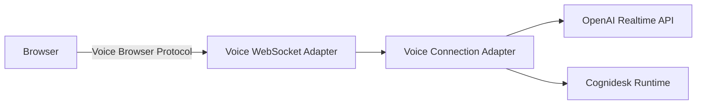

# Voice

This guide covers real-time voice conversations with Cognidesk.

!!! note "Work in progress"
    This guide is being written. Check back soon for complete content.

## Overview

Cognidesk supports live voice conversations through pluggable Voice Connection Adapters. Voice shares the same runtime definitions (agents, journeys, tools, knowledge) as text chat.

## Architecture



## Setup

```bash
pnpm add @cognidesk/voice-openai @cognidesk/voice-websocket
```

## Voice profiles

Configure voice as an agent profile:

```typescript
const agent = createAgent("support", {
  instructions: "...",
  voiceProfile: {
    voice: "alloy",
    instructions: "Keep responses under 30 seconds. Be conversational.",
  },
});
```

## Key concepts

- **Voice Browser Protocol** — Cognidesk-owned WebSocket protocol for browser voice
- **Voice Audio Deltas** — Base64-encoded PCM audio (16-bit, mono, 24 kHz)
- **Server-Mediated Connection** — Provider sessions managed server-side
- **Voice Events** — Durable runtime events from voice interactions

## Shared definitions

Voice conversations use the same journeys, tools, and knowledge as text — no duplication needed. The runtime automatically optimizes definitions for voice context.
