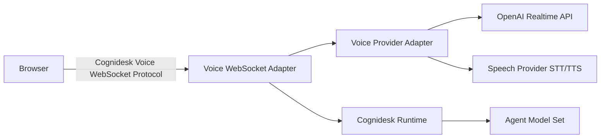

# Voice

This guide covers real-time voice conversations with Cognidesk.

## Overview

Cognidesk supports live voice conversations through pluggable voice provider adapters. Voice shares the same runtime definitions (agents, journeys, tools, knowledge, policy, and events) as text chat.

There are two different layers:

| Layer | Import | Role |
|-------|--------|------|
| Voice provider | `@cognidesk/voice-openai` | OpenAI Realtime voice session adapter used by the provider catalog. |
| Speech providers | `@cognidesk/voice-elevenlabs`, `@cognidesk/voice-azure-speech`, `@cognidesk/voice-aws-speech`, `@cognidesk/voice-google-speech`, `@cognidesk/voice-deepgram` | STT/TTS-backed `VoiceProvider`s where Cognidesk runs the background Agent Model Set. |
| Voice provider APIs | `@cognidesk/voice-elevenlabs`, `@cognidesk/voice-twilio`, `@cognidesk/voice-vonage`, `@cognidesk/voice-sip` | Provider voice APIs, telephony objects, SIP/provider operations, and outbound-capable surfaces where supported. |
| Browser transport | `@cognidesk/voice-websocket` | Cognidesk-owned WebSocket protocol between browser and server. |

The OpenAI adapter supports `gpt-realtime-2` for realtime voice. Speech Provider-backed adapters use the provider for speech-to-text and text-to-speech only; the background LLM is the normal Cognidesk Agent Model Set configured through `@cognidesk/model`. None of these adapters provide full provider API coverage, browser credential issuance, telephony, recording storage, consent, or retention policy.

## Architecture



## Setup

```bash
pnpm add @cognidesk/voice-openai @cognidesk/voice-deepgram @cognidesk/voice-azure-speech @cognidesk/voice-websocket
```

## Voice profiles

Configure voice on the agent builder:

```typescript
const agent = createAgent("support", {
  instructions: "...",
});

agent.voice({
  instructions: "Keep spoken responses concise and conversational.",
  modelSet: {
    provider: "openai",
    model: "gpt-realtime-2",
    voice: "alloy",
  },
  recording: {
    enabled: false,
  },
});
```

## Server wiring

The HTTP handler creates voice socket metadata. The WebSocket adapter owns the browser voice protocol and connects it to the selected provider.

```typescript
import { createCognideskHttpHandler } from "@cognidesk/http";
import { createOpenAIVoiceProvider } from "@cognidesk/voice-openai/runtime";
import { createDeepgramSpeechVoiceProvider } from "@cognidesk/voice-deepgram/runtime";
import { createAzureSpeechVoiceProvider } from "@cognidesk/voice-azure-speech/runtime";
import {
  attachNodeVoiceWebSocketAdapter,
  createInMemoryVoiceSessionStore,
  createVoiceSocketHandshake,
} from "@cognidesk/voice-websocket";

const voiceSessionStore = createInMemoryVoiceSessionStore();
const voiceProvider = createOpenAIVoiceProvider({
  apiKey: process.env.OPENAI_API_KEY,
});

const azureSpeechProvider = createAzureSpeechVoiceProvider({
  speechKey: process.env.AZURE_SPEECH_KEY,
  region: process.env.AZURE_SPEECH_REGION,
  voiceName: "en-US-AvaMultilingualNeural",
});

const deepgramSpeechProvider = createDeepgramSpeechVoiceProvider({
  apiKey: process.env.DEEPGRAM_API_KEY,
  textToSpeechModel: "aura-2-thalia-en",
  speechToTextModel: "nova-3",
});

const handler = createCognideskHttpHandler({
  runtime,
  agentId: agent.id,
  basePath: "/api",
  voice: createVoiceSocketHandshake({
    store: voiceSessionStore,
  }),
});

attachNodeVoiceWebSocketAdapter({
  server,
  store: voiceSessionStore,
  runtime,
  provider: voiceProvider,
  ...(agent.voice ? { profile: agent.voice } : {}),
  pathPrefix: "/api/voice/connections",
});
```

## Browser client

`@cognidesk/react` exposes low-level voice client APIs through the same HTTP client used for chat:

```tsx
import { createCognideskClient, useVoice } from "@cognidesk/react";

const client = createCognideskClient({ baseUrl: "/api" });

function VoiceButton() {
  const voice = useVoice({
    client,
    agentId: "support",
  });

  return (
    <button onClick={() => void voice.start()} disabled={voice.status === "connecting"}>
      {voice.status === "connected" ? "Connected" : "Start voice"}
    </button>
  );
}
```

## Runtime behavior

Voice conversations can either:

- commit provider transcripts into the runtime and let `handleVoiceUserMessage` run the normal Cognidesk turn pipeline; or
- use a provider control surface that projects selected Cognidesk voice tools into the realtime provider session.

In both modes, the runtime remains the source of truth for conversations, channel segments, voice transcript events, interruptions, handoff, and snapshots. Speech Provider-backed adapters such as ElevenLabs, Azure Speech, AWS Speech, Google Cloud Speech, and Deepgram always use the first mode: STT creates the user transcript, Cognidesk runs the agent turn with the configured Model Provider, and TTS speaks the assistant response.

## Enterprise speech providers

| Provider | Import | Notes |
|----------|--------|-------|
| Amazon Transcribe + Amazon Polly | `@cognidesk/voice-aws-speech` | Uses injected AWS SDK v3 clients so the application owns IAM, region, temporary credentials, and private-network policy. |
| Google Cloud Speech-to-Text + Text-to-Speech | `@cognidesk/voice-google-speech` | Uses Google Cloud REST with a server-side OAuth access token or token provider. |
| Deepgram | `@cognidesk/voice-deepgram` | Uses Deepgram REST STT/TTS and does not invoke Deepgram Voice Agent. |

## Key concepts

- **Voice Browser Protocol** — Cognidesk-owned WebSocket protocol for browser voice
- **Voice Audio Deltas** — Base64-encoded PCM audio (16-bit, mono, 24 kHz)
- **Server-Mediated Connection** — Provider sessions managed server-side
- **Voice Events** — Durable runtime events from voice interactions
- **Voice Provider Integration** — Category/provider module that connects realtime audio to a provider/runtime session or exposes provider voice APIs
- **Speech Provider** — Provider STT/TTS used for voice I/O while Cognidesk owns the agent turn
- **Voice WebSocket Transport** — Cognidesk-owned infrastructure package that carries browser voice events to the server

## Shared definitions

Voice conversations use the same journeys, tools, and knowledge as text. Channel-specific voice behavior lives in the agent voice profile, runtime channel policy, provider configuration, and SDK-user application code.
