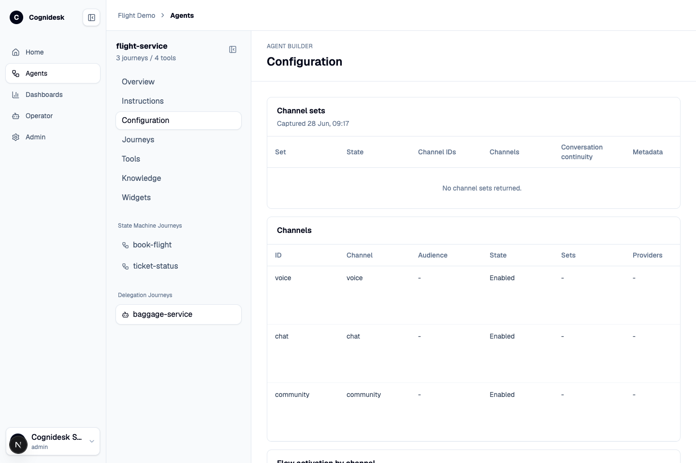

# Agent Configuration In Studio

The Agents view turns a compiled Cognidesk agent into something inspectable. It answers questions that are hard to answer from code alone: Which journeys are actually registered? Which states can a customer move through? Which tools can run? Which channels are enabled? Which providers are configured but blocked by missing credentials?

The `book-flight` journey above is a state machine. It makes the support path visible: collect route details, search mocked flights, branch into selection or no-flight handling, collect the passenger name, run the booking action, and finish in the booked state. The graph is useful for non-engineers because it turns hidden conversation control flow into a reviewable map.

## Agent inspection

Studio reads agent introspection from the target adapter. The view groups the information by authoring concern:

| Section | What it explains |
|---------|------------------|
| Overview | Agent id, journey count, tool count, knowledge count, widget count, and agent-level policy facts. |
| Instructions | The base instructions reported by the compiled agent. |
| Journeys | State-machine journeys and delegated journeys, including their graph, states, transitions, tools, and prompts. |
| Tools | Tool names, side-effect metadata, and descriptions. |
| Knowledge | Knowledge sources, document counts when available, and which journeys use them. |
| Widgets | UI widget kinds the agent can emit, such as confirmation, choice, date, or text input prompts. |

State-machine journeys and delegated journeys are shown separately because they solve different problems. A state-machine journey keeps workflow state explicit inside the main support flow. A delegated journey hands a bounded specialist task to a focused unit and returns control to the main agent.

## Configuration surface

The configuration tab shows the channel and integration layer reported by the target. This is where non-runtime questions become visible: which channels are enabled, what handoff is allowed, which provider packages are installed, and whether credentials are ready.

| Table | What to look for |
|-------|------------------|
| Channel sets | Related channels that can preserve conversation continuity together. |
| Channels | Channel id, channel type, audience, state, providers, capabilities, policies, and metadata. |
| Flow activation by channel | Which journeys are active or blocked for a specific channel. |
| Outbound and handoff policy | Which channels can send replies, drafts, outbound contact, handoff requests, or provider updates. |
| SDK policy details | The exact policy fields exposed by the target configuration surface. |
| Channel behavior | Tone, size limits, markdown support, widgets, draft-first behavior, and other channel-specific behavior. |
| Integration readiness | Catalog coverage, target setup, credential readiness, status, and blockers. |
| Provider packages | Provider, category, trust level, coverage, directions, audience, credentials, privacy, limitations, and maintainers. |
| Capability availability | Which provider capabilities are enabled, disabled, blocked, or only partially ready. |
| Credential status | Required credentials, scopes, expiry, and readiness messages. |

## Why this matters

Without this view, support behavior often gets split between agent instructions, provider adapter code, environment variables, and undocumented operational knowledge. Studio makes the active shape visible. A product owner can see whether WhatsApp is configured, an operator can see why human handoff is unavailable, and an engineer can confirm that a channel-specific policy is actually exposed by the target.
