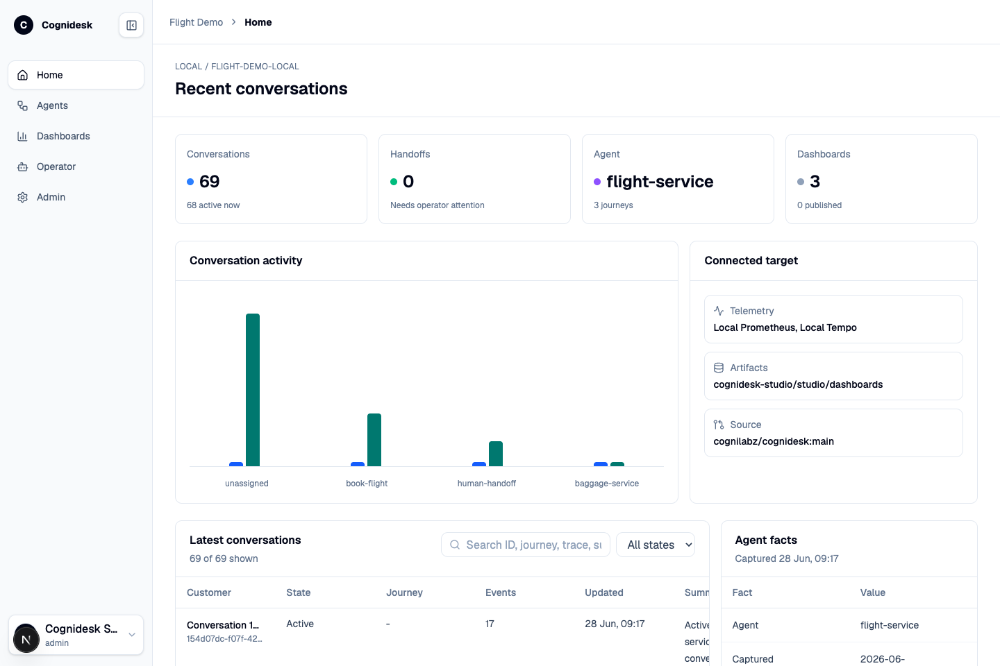

# Cognidesk Studio

Cognidesk Studio is the operations surface for a configured Cognidesk target. It is not a separate runtime and it does not replace the application that owns the agent. Studio connects to a target through the Studio Adapter, reads the target manifest, inspects the compiled agent, follows conversations and runtime events, and gives operators a controlled workspace for analysis, dashboard creation, and source-backed changes.



## Package

Studio is published as `@cognidesk/studio`, and the operator execution service
is published as `@cognidesk/studio-operator-runtime`, for deployments that
install Studio services from npm:

=== "pnpm"

    ```bash
    pnpm add @cognidesk/studio @cognidesk/studio-operator-runtime
    ```

=== "npm"

    ```bash
    npm install @cognidesk/studio @cognidesk/studio-operator-runtime
    ```

=== "yarn"

    ```bash
    yarn add @cognidesk/studio @cognidesk/studio-operator-runtime
    ```

The packages contain the Studio web application source, operator runtime source,
and service scripts. Running them still requires a target manifest, Studio
database settings, auth secrets, and the Studio operator runtime configuration
when Operator source workflows are enabled. For a complete local stack, use the
[local development runbook](../getting-started/local-development.md).

## What Studio helps with

Studio is useful when a support agent has moved beyond a local prototype and people need to understand, operate, and improve it without reading every package in the repository.

| Need | How Studio helps |
|------|------------------|
| Understand the live target | The home view shows target health, recent conversation volume, handoff counts, connected telemetry sources, artifact storage, and source repository metadata. |
| Inspect agent behavior | The Agents view shows the compiled agent: instructions, state-machine journeys, delegated journeys, tools, knowledge sources, widgets, channel behavior, and integration readiness. |
| Debug conversations | Conversation detail pages show the transcript, lifecycle, active journey and state, runtime snapshot, event timeline, and trace IDs when available. |
| Review configuration | Studio reads the target configuration surface so teams can see channel sets, channel policies, outbound/handoff rules, provider packages, credentials, and blockers in one place. |
| Generate operational views | Operator can create dashboard artifacts from conversations, events, telemetry, and target context. Dashboards can be reviewed, checked, revised, saved, and published. |
| Let an operator improve the system | The Operator workspace runs controlled sessions against the configured target and source allowlist. It can explain, draft, edit, validate, and produce artifacts without bypassing the target's policy boundaries. |
| Govern access | Studio includes local authentication, roles, admin views, credential grants, operator session records, and audit-oriented storage. |

## Main areas

| Area | Purpose |
|------|---------|
| Home | Operational snapshot for the configured target: conversations, handoffs, connected telemetry, artifacts, and source repository. |
| Agents | Agent and configuration inspection: journeys, tools, knowledge, widgets, channel behavior, integrations, readiness, and credentials. |
| Dashboards | Saved dashboard artifacts, versions, generated data, publish lifecycle, and rendered operational views. |
| Operator | Chat-style operator sessions with model selection, reasoning effort, activity events, dashboard creation, diffs, validation, and artifact review. |
| Admin | Users, roles, permissions, credential grants, operator sessions, and audit-oriented administration. |

## How Studio fits the architecture

Studio sits beside the runtime. The runtime remains the place where conversations, journeys, policies, tools, knowledge, and output resolution happen. Studio uses adapter endpoints to read and operate against that runtime. That separation matters: Studio can inspect and improve a target without becoming a hidden channel adapter or an unreviewed control plane.

The usual loop is:

1. A target application exposes Studio Adapter endpoints.
2. Studio loads the target manifest and authenticates target requests.
3. Studio reads health, introspection, configuration, conversations, events, snapshots, metrics, and traces.
4. An operator reviews the system, asks questions, creates dashboards, or requests bounded source work.
5. Operator work runs through the configured model list, source allowlist, sandbox, validation commands, and artifact store.
6. The output is reviewed as an event, artifact, dashboard, diff, or source-work proposal.

## Local Flight Demo

The Flight Demo is the reference target used throughout these screenshots. It shows a realistic support shape in a small app: chat, voice, booking, ticket status, baggage delegation, optional email/WhatsApp/Discord journeys, Studio Adapter endpoints, and Studio dashboards.

See the [Flight Demo example](../examples/flight-demo.md) for the customer-facing flow and the [local development runbook](../getting-started/local-development.md) for startup commands.
