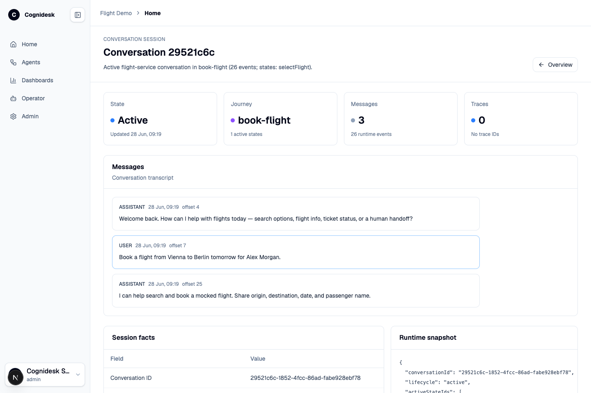
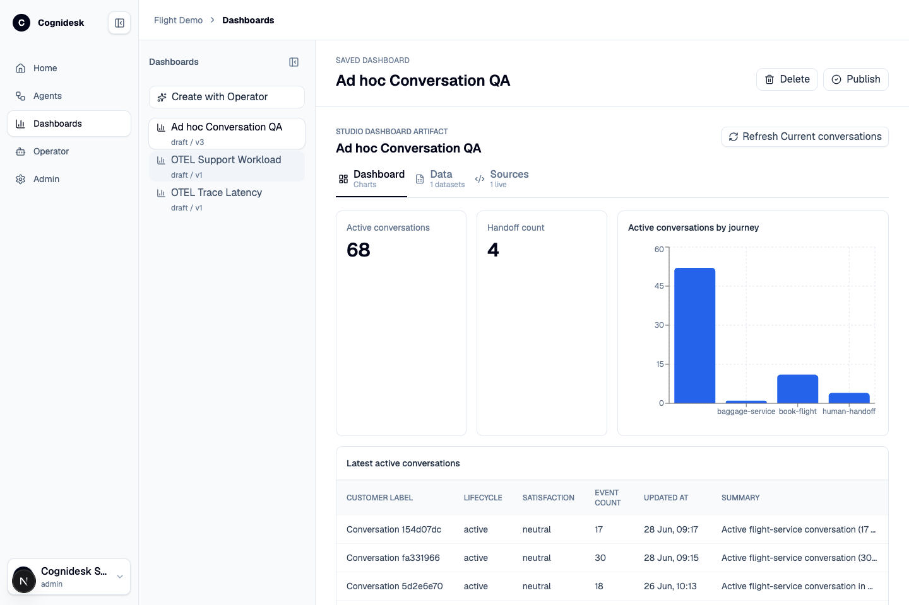

# Observability And Dashboards

Studio uses runtime events as the common record for support operations. Conversations, handoffs, journey states, tool runs, snapshots, dashboards, and telemetry all become easier to inspect because they point back to the same target and conversation model.

## Conversation observability

The Home view gives a quick operational read: total conversations, active conversations, handoffs, agent readiness, dashboards, telemetry sources, artifact storage, and source repository.

From there, each conversation opens into a detail page with:

| Area | Use |
|------|-----|
| State metrics | Lifecycle, active journey, active states, message count, and trace count. |
| Transcript | Customer and assistant messages derived from runtime events. |
| Session facts | Conversation id, agent id, lifecycle, active journey, active states, trace ids, created time, and updated time. |
| Runtime snapshot | The current runtime state for debugging and replay-style reasoning. |
| Event timeline | Ordered runtime events with offset, time, kind, signal, trace id, and summary. |

This is the practical debugging surface for state and delegated journeys. You can see that a conversation is active in `book-flight`, which state is active, which events were emitted, and what the runtime snapshot currently contains.

## Dashboard artifacts

Studio dashboards are generated artifacts, not a separate report engine hidden outside the system. A dashboard artifact can include a title, version, status, generated React dashboard code, datasets, specs, fallback data, and metadata. The dashboard lifecycle is visible: draft, check, revise, save, publish, and delete.

Dashboards are useful for:

- Conversation workload views.
- Journey activation and state distribution.
- Handoff volume.
- Tool execution and outcome analysis.
- Token or model usage views when telemetry is configured.
- Target-specific operational reports generated from the adapter and event data.

## Telemetry sources

Studio can point at configured telemetry sources from the target manifest. In local development, the root compose profile can start OpenTelemetry Collector, Prometheus, and Tempo next to Studio and the Flight Demo.

When telemetry is available, Studio can connect runtime events to metrics and traces. When it is not available, the conversation/event/snapshot views still work from the target adapter. This gives a graceful local-to-production path: start with adapter-backed observability, then add metrics and traces when the environment is ready.
