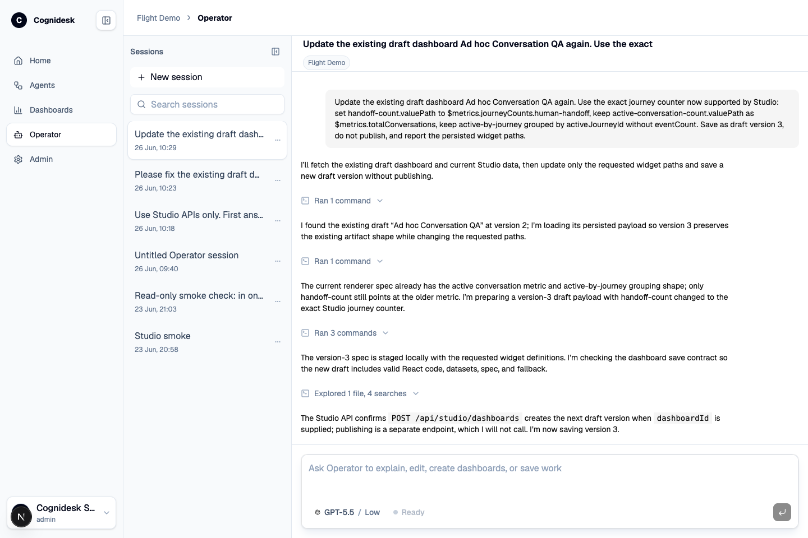

# Operator Workflows

The Studio Operator is a controlled workbench for improving and explaining a target. It is intentionally different from a generic chat box: it knows the target manifest, allowed source paths, available models, reasoning settings, validation commands, artifact store, and dashboard workflow.

## What an operator can ask for

Typical operator tasks include:

| Task | Output |
|------|--------|
| Explain behavior | A source-backed explanation of journeys, tools, policies, or runtime events. |
| Investigate a conversation | A summary of what happened, which journey/state was active, and where the next action should happen. |
| Create a dashboard | A generated dashboard artifact with data, code, and a preview. |
| Revise a dashboard | Updated chart structure, labels, filters, or explanatory copy. |
| Check a dashboard | Validation result for generated dashboard code and data shape. |
| Draft source changes | Diffs inside the configured allowlist, not an unrestricted repository edit. |
| Run validation | Configured commands such as typecheck, tests, lint, or docs build. |
| Save work | Dashboard artifacts, session history, and operator activity records. |

## Operator session flow

1. The operator starts or resumes a Studio Operator session.
2. Studio sends target context, manifest constraints, model choice, and reasoning effort.
3. The operator runtime works in a disposable sandbox rooted under the configured sandbox directory.
4. Source work is constrained by the manifest allowlist.
5. Tool/activity events stream back into the Operator UI.
6. Generated dashboards can be opened in a side panel, checked, revised, published, or deleted.
7. Validation commands run only from the configured command list.
8. Final output remains reviewable as messages, events, artifacts, diffs, and saved sessions.

## Agent configuration through Operator

Operator can help change agent configuration only through source-backed work. That distinction is important. Studio can show the active configuration surface immediately, but durable configuration changes still belong in the target repository and go through validation.

For example, an operator might ask:

- "Explain why WhatsApp is unavailable in this target."
- "Add a safer handoff policy for the chat channel."
- "Create a dashboard for book-flight conversations and handoffs."
- "Show where the baggage delegated journey is defined."
- "Draft a docs update for the enabled provider packages."

Operator can then inspect files, propose edits, run configured checks, and surface the diff for review. It should not silently mutate production behavior outside source control or target policy.

## Generated reports

When people say "generated reports" in Studio, the concrete product surface is generated dashboards and artifacts. A dashboard can summarize operational data for a target, but it stays traceable: it has a stored artifact, version, status, datasets, generated code, and optional validation results.

That makes the report useful beyond one chat answer. It can be reopened, checked, revised, published, and tied back to the target that produced it.
